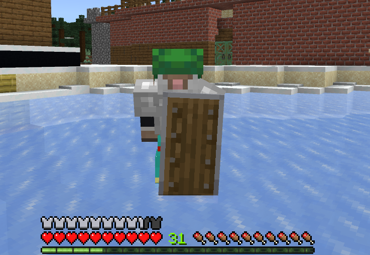

# MINT AI
An AI for chatting.

### Important: This is the main branch which includes the newest unstable canary build. Please switch to a version tag for the normal version.

To activate code, replace following line in main.py:
`activation=False`
with
`activation=True`

©Adam Basly. Alle Rechte vorbehalten.

